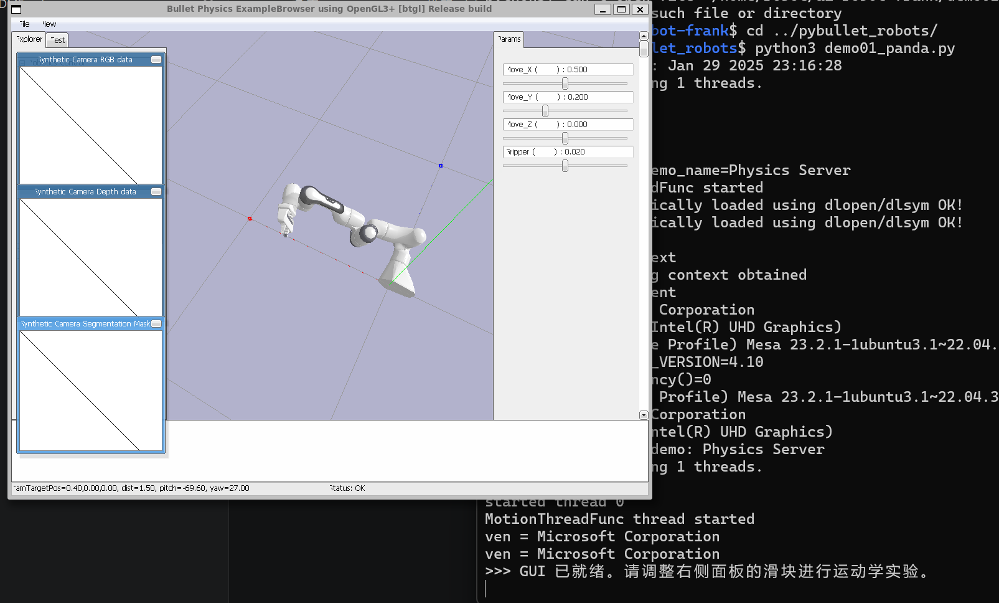

🤖 机器人学核心概念：空间与运动学在机器人控制中，我们通常在两套不同的“坐标系”下描述机器人的状态。  
1. 核心空间对比特性关节空间 (Joint Space)笛卡尔坐标空间 (Cartesian Space)定义维度每一个关节的状态向量 $q = [\theta_1, \theta_2, ..., \theta_n]$末端位姿向量 $P = [x, y, z, Roll, Pitch, Yaw]$描述对象机器人内部：电机的转动角度或伸缩距离外部世界：末端执行器在三维世界的位置坐标单位弧度 (rad) 或 角度 (deg)米 (m) 或 毫米 (mm)直观程度抽象：人很难直观想象角度对应的空间位置直观：符合人类对前后、上下、左右的认知主要用途电机伺服控制、检查是否达到物理限位任务路径规划、目标抓取、避障2. 空间转换：运动学 (Kinematics)机器人系统的核心逻辑就在于这两个空间之间的相互“翻译”：🔄 正向运动学 (Forward Kinematics, FK)逻辑：已知 关节角度 $\rightarrow$ 推算 末端位置。特点：计算简单、结果唯一。只要确定了每个关节的姿态，机械手在空间的位置就是确定的。🔄 逆向运动学 (Inverse Kinematics, IK)逻辑：给定 目标坐标 $\rightarrow$ 求解 关节角度。特点：计算复杂、存在多解或无解。例如：你可以保持手部不动，但通过旋转肘部（手肘向上或向下）来改变姿态，这就是典型的“多解”现象。3. 实验总结关节输入模式 (FK)：通过手动调节 J0-J6 滑块，你是在控制机器人的“骨骼”旋转，观察末端坐标如何随之改变。坐标输入模式 (IK)：通过输入 X, Y, Z 指令，让计算机通过算法计算出 7 个关节该如何协同运动以到达目标点。💡 提示：在实际开发中，我们通常在坐标空间规划任务（比如“去拿杯子”），而在关节空间执行控制（向电机发送脉冲信号）



在pybullet_robots 目录下新建一个python程序文件并运行


```
import pybullet as p
import pybullet_data as pd
import time
import math

# --- 1. 环境初始化 ---
p.connect(p.GUI)
p.setAdditionalSearchPath(pd.getDataPath())
p.configureDebugVisualizer(p.COV_ENABLE_GUI, 1)
p.configureDebugVisualizer(p.COV_ENABLE_Y_AXIS_UP, 1)
p.resetDebugVisualizerCamera(1.5, 45, -30, [0.4, 0, 0])

# 加载 Panda 机器人
# useFixedBase=True 保证机器人底座固定在原点
pandaId = p.loadURDF("franka_panda/panda.urdf", [0, 0, 0], useFixedBase=True)

# --- 2. 创建 GUI 控制面板 ---
# 参数：名称, 最小值, 最大值, 默认值
target_x = p.addUserDebugParameter("Move_X (前后)", 0.2, 0.8, 0.5)
target_y = p.addUserDebugParameter("Move_Y (上下)", 0.0, 0.6, 0.2)
target_z = p.addUserDebugParameter("Move_Z (左右)", -0.5, 0.5, 0.0)
gripper_slider = p.addUserDebugParameter("Gripper (夹爪)", 0, 0.04, 0.02)

# 绘制简单的世界坐标轴 (RGB颜色对应 XYZ)
p.addUserDebugLine([0,0,0], [0.2,0,0], [1,0,0], 3) # X-红
p.addUserDebugLine([0,0,0], [0,0.2,0], [0,1,0], 3) # Y-绿
p.addUserDebugLine([0,0,0], [0,0,0.2], [0,0,1], 3) # Z-蓝

# 用于存储调试文字的 ID，方便后续清除
text_id = -1

print(">>> GUI 已就绪。请调整右侧面板的滑块进行运动学实验。")

# --- 3. 核心循环 ---
try:
    while True:
        # A. 读取滑块数值
        tx = p.readUserDebugParameter(target_x)
        ty = p.readUserDebugParameter(target_y)
        tz = p.readUserDebugParameter(target_z)
        gp = p.readUserDebugParameter(gripper_slider)

        # B. 逆向运动学 (IK) 求解
        # Link 11 是 Panda 的末端执行器。姿态设为朝下 [0, -pi, 0]
        jointPoses = p.calculateInverseKinematics(
            pandaId, 11, [tx, ty, tz], 
            p.getQuaternionFromEuler([0, -math.pi, 0])
        )

        # C. 控制关节运动 (前7个是旋转关节)
        for i in range(7):
            p.setJointMotorControl2(
                pandaId, i, p.POSITION_CONTROL, jointPoses[i],
                force=500 # 增加力量使运动更稳健
            )
        
        # 夹爪控制 (手指关节通常是 9 和 10)
        for i in [9, 10]:
            p.setJointMotorControl2(pandaId, i, p.POSITION_CONTROL, gp)

        # D. 更新实时信息展示
        # 每次循环先删除旧文字，再添加新文字，避免参数不兼容问题
        if text_id != -1:
            p.removeUserDebugItem(text_id)
        
        info_str = f"Target Pos: [{tx:.2f}, {ty:.2f}, {tz:.2f}]"
        text_id = p.addUserDebugText(info_str, [0, 0.8, 0], [0,0,0], 1.5)

        # 执行仿真步进
        p.stepSimulation()
        time.sleep(1./120.)

except Exception as e:
    print(f"\n[提示] 实验结束: {e}")
finally:
    p.disconnect()
```